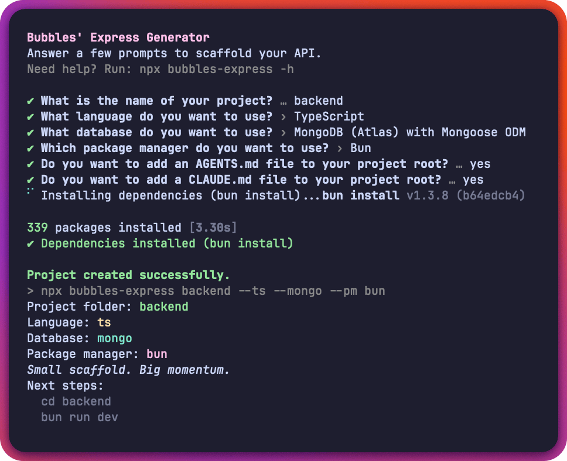

# bubbles-express-generator [](https://www.npmjs.com/package/bubbles-express-generator)

Scaffold an Express backend with your preferred stack:

- JavaScript or TypeScript
- MongoDB (Mongoose) or PostgreSQL (Drizzle)
- npm or Bun workflow



## Table of contents

- [Installation](#installation)
- [Usage examples](#usage-examples)
- [CLI output style](#cli-output-style)
- [Architecture and folder structure](#architecture-and-folder-structure)
- [Configuration and env variables](#configuration-and-env-variables)
- [Testing and quality checks](#testing-and-quality-checks)
- [Safety behavior](#safety-behavior)
- [Optional AGENTS.md and CLAUDE.md](#optional-agentsmd-and-claudemd)
- [Documentation index](#documentation-index)
- [Contributing](#contributing)
- [License and credits](#license-and-credits)

## Installation

### No install (recommended)

```bash
npx bubbles-express
```

```bash
bunx --bun bubbles-express
```

### Global install (optional)

```bash
npm install -g bubbles-express-generator
```

```bash
bun add -g bubbles-express-generator
```

## Usage examples

### Interactive flow

```bash
npx bubbles-express
```

### Fully non-interactive flow

```bash
npx bubbles-express my-api --ts --pg --pm npm
```

```bash
bunx --bun bubbles-express my-api --js --mongo --pm bun --skip-install
```

### Supported template matrix

- `js-mongo`
- `js-pg`
- `ts-mongo`
- `ts-pg`

## CLI output style

The CLI favors concise, line-based output:

- minimal startup context
- plain help sections (`Usage`, `Flags`, `Examples`)
- direct danger messaging for destructive flows
- compact success summary with one signature line

Example success output:

```text
Project created successfully.
Project folder: my-api
Language: ts
Database: pg
Package manager: npm
Small scaffold. Big momentum.
Next steps:
  cd my-api
  npm run dev
```

## Architecture and folder structure

```text
bubbles-express-generator/
├─ cli/                       # generator entrypoint + prompt/copy/install flow
├─ templates/                 # scaffold templates
│  ├─ js-mongo/
│  ├─ js-pg/
│  ├─ ts-mongo/
│  ├─ ts-pg/
│  └─ agent-instructions/
│     ├─ js/                  # optional AGENTS.md / CLAUDE.md for JS projects
│     └─ ts/                  # optional AGENTS.md / CLAUDE.md for TS projects
├─ tests/                     # CLI integration tests
├─ documentation/project-docs/# focused internal project docs
├─ README.md
└─ CHANGELOG.md
```

Generated projects use a `src/` structure for both JS and TS templates.

## Configuration and env variables

### CLI flags

- `--ts` or `--js`: language
- `--mongo` or `--pg`: database
- `--pm <bun|npm>`: package manager
- `--skip-install`: scaffold only, no dependency install
- `-h, --help`: show help

### Generator env vars

- `BUBBLES_PM=bun|npm`: package manager override
- `BUBBLES_SKIP_INSTALL=1`: skip dependency installation

### Generated project env vars

- `CORS_ORIGIN`: comma-separated CORS allowlist (dev defaults to localhost)
- `TRUST_PROXY=1`: enables `app.set('trust proxy', 1)`

Non-interactive runs must include `--pm` or `BUBBLES_PM`.

## Testing and quality checks

Root project commands:

- `npm run lint`
- `npm run test`
- `npm run dev`

GitHub Actions CI (`.github/workflows/test.yml`) runs on `ubuntu-latest` with
Node.js `22`, installs dependencies with `npm ci`, then runs:

- `npm run lint`
- `npm run test`

Bun equivalents:

- `bun run lint`
- `bun run test:bun`
- `bun run dev:bun`

Generated project commands include:

- `dev`
- `lint`
- `test`
- `typecheck` (TypeScript templates)

When Bun is selected in scaffolding, generated test scripts stay Vitest-based
(`bunx vitest run` and `bunx vitest`) to match the template test suites.

## Safety behavior

When scaffolding into `.` and the directory is non-empty:

1. CLI shows a high-friction danger warning.
2. You can choose:
   - use a new project name
   - overwrite current directory
   - cancel
3. Overwrite requires typing `DELETE_CURRENT_DIR`.

If confirmation is wrong, scaffolding is canceled without mutating files.

## Optional AGENTS.md and CLAUDE.md

During interactive setup, the CLI asks two separate questions:

- Add `AGENTS.md`?
- Add `CLAUDE.md`?

If selected, files are copied to the generated project root from:

- `templates/agent-instructions/js/` for JavaScript templates
- `templates/agent-instructions/ts/` for TypeScript templates

## Documentation index

- `documentation/project-docs/structure.md`
- `documentation/project-docs/cli-behavior.md`
- `documentation/project-docs/output-style.md`
- `documentation/project-docs/templates.md`
- `documentation/project-docs/configuration.md`
- `documentation/project-docs/testing.md`
- `documentation/project-docs/dependencies.md`
- `documentation/project-docs/contributing.md`

## Contributing

- Open an issue for bugs or feature ideas.
- Keep PRs focused and include tests for behavior changes.
- Run `npm run lint` and `npm test` before opening a PR.
- See [documentation/project-docs/contributing.md](documentation/project-docs/contributing.md) for PR description guidelines.

## License and credits

- License: MIT (`LICENSE`)
- Author: Manuel Fahrenholz ([mrbubbles-src](https://github.com/mrbubbles-src))
